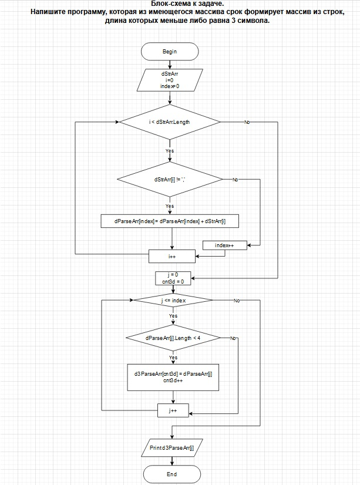

# **Задача. Напишите программу, которая из имеющегося массива срок формирует массив из строк, длина которых меньше либо равна 3 символа.**

## Решение:

1. Вводим с клавиатуры значения разделенные запятой.
2. Преобразуем введенную строку в массив стоковых элементов.
3. Проверяем длину каждого элемента сформированного Массива и если она меньше или равна 3, то заносим элемент в Результирующий Массив.
4. Выводим Результирующий Массив с элементами длина которых меньше или равна 3, либо сообщаем что таких элементов нет. 

